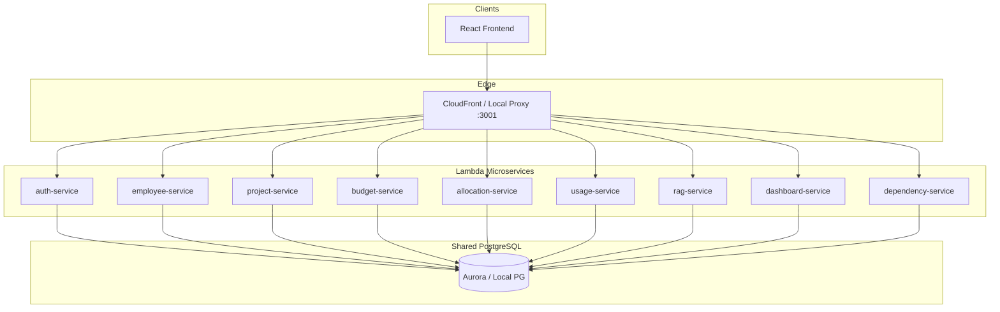
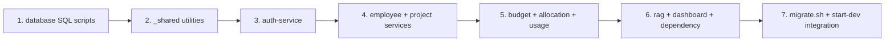

# ACME Budget & Resource Tracker — Backend Architecture Plan

## Context and Constraints

From [ACME Project Budget and Resource Tracker.pdf](ACME%20Project%20Budget%20and%20Resource%20Tracker.pdf), the MVP tracks **projects, employees, budgets, resource allocations, actual usage, RAG health status, and (stretch) dependencies**. Core formula:

```
budget_used_percent = budget_used / allocated_budget * 100
hours_used_percent  = hours_used / allocated_hours * 100
progress_gap        = max(budget_used_percent, hours_used_percent) - actual_completion_percent

Green  if progress_gap <= 10
Amber  if 10 < progress_gap <= 25
Red    if progress_gap > 25
```

**Confirmed decisions:**
- Stack: Workshop **Lambda + psycopg3** pattern from [`backend/_examples/python-service`](backend/_examples/python-service) — not FastAPI/SQLAlchemy
- Database: **Single shared PostgreSQL** (local Docker + Aurora via [`infra/rds.tf`](infra/rds.tf))
- Each service deploys as its own Lambda; Terraform auto-discovers `backend/*/function.py` and routes `/api/{service-name}*` ([`infra/cloudfront.tf`](infra/cloudfront.tf))



---

## 1. PostgreSQL Schema Design

Create a new `database/` directory at repo root with ordered SQL scripts and a migration runner.

### Directory layout

```
database/
├── migrate.sh                    # Apply scripts in order (local + cloud)
├── schema/
│   ├── 001_extensions_enums.sql
│   ├── 002_tables.sql
│   ├── 003_indexes_constraints.sql
│   ├── 004_functions_triggers.sql
│   └── 005_views.sql
└── seed/
    └── 001_demo_data.sql         # Optional demo users/projects for dev
```

### Enums (`001_extensions_enums.sql`)

| Enum | Values |
|------|--------|
| `user_role` | `admin`, `manager`, `employee` |
| `project_stage` | `planning`, `active`, `on_hold`, `completed`, `cancelled` |
| `rag_status` | `green`, `amber`, `red` |
| `dependency_type` | `finish_to_start`, `start_to_start`, `finish_to_finish` |

Enable `pgcrypto` for `gen_random_uuid()`.

### Tables (`002_tables.sql`)

**`app_users`** — authentication + future RBAC

| Column | Type | Notes |
|--------|------|-------|
| `id` | UUID PK | |
| `email` | VARCHAR(255) UNIQUE NOT NULL | |
| `password_hash` | VARCHAR(255) NOT NULL | bcrypt |
| `role` | `user_role` NOT NULL DEFAULT `admin` | MVP: all users admin-capable |
| `employee_id` | UUID FK → `employees(id)` NULL | optional link to employee record |
| `created_at`, `updated_at` | TIMESTAMPTZ | |

**`employees`**

| Column | Type | Notes |
|--------|------|-------|
| `id` | UUID PK | |
| `first_name`, `last_name` | VARCHAR(100) NOT NULL | |
| `email` | VARCHAR(255) UNIQUE | |
| `job_title`, `department` | VARCHAR(100) | filter support |
| `hourly_rate` | NUMERIC(10,2) NOT NULL DEFAULT 0 | cost calculations |
| `weekly_capacity_hours` | NUMERIC(5,2) DEFAULT 40 | overallocation detection |
| `is_active` | BOOLEAN DEFAULT true | |
| `created_at`, `updated_at` | TIMESTAMPTZ | |

**`projects`**

| Column | Type | Notes |
|--------|------|-------|
| `id` | UUID PK | |
| `name` | VARCHAR(200) NOT NULL | |
| `description` | TEXT | |
| `stage` | `project_stage` NOT NULL DEFAULT `planning` | |
| `actual_completion_percent` | NUMERIC(5,2) CHECK 0–100 | drives RAG |
| `rag_status` | `rag_status` NOT NULL DEFAULT `green` | denormalized cache |
| `rag_progress_gap` | NUMERIC(5,2) | stored for UI/debug |
| `start_date`, `end_date` | DATE | |
| `project_manager_id` | UUID FK → `employees(id)` NULL | |
| `created_at`, `updated_at` | TIMESTAMPTZ | |

**`project_budgets`** — 1:1 with project for MVP

| Column | Type | Notes |
|--------|------|-------|
| `id` | UUID PK | |
| `project_id` | UUID FK UNIQUE NOT NULL | CASCADE delete |
| `allocated_budget` | NUMERIC(15,2) NOT NULL CHECK > 0 | |
| `budget_used` | NUMERIC(15,2) NOT NULL DEFAULT 0 | maintained by triggers |
| `currency` | CHAR(3) DEFAULT `USD` | |
| `notes` | TEXT | |
| `created_at`, `updated_at` | TIMESTAMPTZ | |

**`project_resource_allocations`** — M:N employee↔project

| Column | Type | Notes |
|--------|------|-------|
| `id` | UUID PK | |
| `project_id` | UUID FK NOT NULL | |
| `employee_id` | UUID FK NOT NULL | |
| `allocated_hours` | NUMERIC(10,2) NOT NULL CHECK > 0 | |
| `hourly_rate_snapshot` | NUMERIC(10,2) | frozen at allocation time |
| `role_on_project` | VARCHAR(100) | e.g. Developer, PM |
| `start_date`, `end_date` | DATE | |
| `created_at`, `updated_at` | TIMESTAMPTZ | |
| UNIQUE(`project_id`, `employee_id`) | | |

**`project_resource_usage`** — actual hours/cost per employee per project

| Column | Type | Notes |
|--------|------|-------|
| `id` | UUID PK | |
| `project_id` | UUID FK NOT NULL | |
| `employee_id` | UUID FK NOT NULL | |
| `usage_date` | DATE NOT NULL | |
| `hours_used` | NUMERIC(10,2) NOT NULL CHECK > 0 | |
| `cost_amount` | NUMERIC(15,2) NOT NULL | `hours_used * rate` at write time |
| `description` | TEXT | |
| `created_at`, `updated_at` | TIMESTAMPTZ | |

**`project_dependencies`** — stretch goal, schema-ready

| Column | Type | Notes |
|--------|------|-------|
| `id` | UUID PK | |
| `project_id` | UUID FK NOT NULL | dependent project |
| `depends_on_project_id` | UUID FK NOT NULL | prerequisite |
| `dependency_type` | `dependency_type` DEFAULT `finish_to_start` | |
| `created_at` | TIMESTAMPTZ | |
| CHECK `project_id != depends_on_project_id` | | |
| UNIQUE(`project_id`, `depends_on_project_id`) | | |

### Indexes (`003_indexes_constraints.sql`)

- `employees(department)`, `employees(is_active)`
- `projects(stage)`, `projects(rag_status)`
- `project_resource_allocations(project_id)`, `project_resource_allocations(employee_id)`
- `project_resource_usage(project_id)`, `project_resource_usage(employee_id)`, `project_resource_usage(usage_date)`
- `project_dependencies(project_id)`, `project_dependencies(depends_on_project_id)`

### DB Functions & Triggers (`004_functions_triggers.sql`)

Centralize RAG and rollup logic in PostgreSQL so all Lambdas stay consistent:

1. **`fn_project_allocated_hours(project_id)`** — `SUM(allocated_hours)` from allocations
2. **`fn_project_hours_used(project_id)`** — `SUM(hours_used)` from usage
3. **`fn_refresh_budget_used(project_id)`** — set `project_budgets.budget_used = SUM(usage.cost_amount)`
4. **`fn_calculate_rag(project_id)`** — returns `(rag_status, progress_gap)` using the business formula; handles zero-division (treat as 0%)
5. **`fn_update_project_rag(project_id)`** — writes `rag_status` + `rag_progress_gap` to `projects`
6. **Triggers** on `project_resource_usage` INSERT/UPDATE/DELETE → refresh budget_used + recalculate RAG
7. **Triggers** on `project_budgets`, `project_resource_allocations`, `projects` (completion %) UPDATE → recalculate RAG
8. **`updated_at` trigger** on all mutable tables

### Views (`005_views.sql`)

- **`v_project_summary`** — per-project rollup: allocated/used budget & hours, completion %, RAG, allocation count, dependency count
- **`v_employee_allocation_summary`** — total allocated hours per employee vs `weekly_capacity_hours` (overallocation)
- **`v_portfolio_dashboard`** — portfolio totals: project counts by RAG/stage, sum budgets, sum hours, overallocated employee count

### Migration runner (`database/migrate.sh`)

- Reads `POSTGRES_*` env vars (same as Lambdas)
- Applies `schema/*.sql` then optional `seed/*.sql`
- Idempotent where possible (`CREATE TABLE IF NOT EXISTS`, guarded enum creation)
- Hook into [`bin/start-dev.sh`](bin/start-dev.sh) after Postgres starts

---

## 2. Shared Backend Utilities

Lambda packaging zips **only** each service directory ([`infra/lambda.tf`](infra/lambda.tf)). Add vendored shared helpers:

```
backend/_shared/
├── pg_connection.py    # PG_CONFIG builder + sslmode=require when IS_LOCAL=false
├── http_router.py      # Parse Lambda Function URL event → method, path, body, query
├── responses.py        # json_response(status, body), error_response(...)
├── auth_jwt.py         # bcrypt hash/verify, JWT encode/decode (PyJWT)
└── validators.py       # UUID, email, percent range, required fields
```

Add `bin/sync-shared.sh` to copy `_shared/*.py` into each service before `start-dev.sh` / deploy. Each service imports locally: `from pg_connection import get_connection`.

**New env var** (add to [`infra/locals.tf`](infra/locals.tf) `env_vars`):

- `JWT_SECRET` — use `random_id` or derive from `app_id` for MVP token signing

---

## 3. Microservice Decomposition (9 Lambdas)

Copy [`backend/_examples/python-service`](backend/_examples/python-service) to each folder below. Each service contains:

| File | Responsibility |
|------|----------------|
| `function.py` | HTTP routing, auth middleware, request validation, calls `postgres_service` |
| `postgres_service.py` | Domain SQL (CRUD + queries), module-level `PG_CONN` pooling |
| `requirements.txt` | `psycopg[binary]`, `PyJWT`, `bcrypt` |

### Service map

| Folder | Bounded context | Tables touched |
|--------|-----------------|----------------|
| `backend/auth-service` | Registration, login, profile | `app_users` |
| `backend/employee-service` | Employee CRUD | `employees` |
| `backend/project-service` | Project CRUD + summary | `projects`, reads `v_project_summary` |
| `backend/budget-service` | Budget CRUD | `project_budgets` |
| `backend/allocation-service` | Allocation CRUD | `project_resource_allocations` |
| `backend/usage-service` | Usage CRUD | `project_resource_usage` |
| `backend/rag-service` | Explicit RAG recalc/read | `projects` via DB functions |
| `backend/dashboard-service` | Portfolio read models | views only |
| `backend/dependency-service` | Dependency CRUD (stretch) | `project_dependencies` |

### API endpoints (routed inside each `function.py`)

Paths are relative to `/api/{service-name}` (Terraform convention).

**auth-service**

| Method | Path | Action |
|--------|------|--------|
| POST | `/register` | Create user, hash password, return JWT |
| POST | `/login` | Validate credentials, return JWT |
| GET | `/me` | Return current user from `Authorization: Bearer` |

**employee-service** — standard REST per [`docs/implementation.md`](docs/implementation.md)

| Method | Path | Action |
|--------|------|--------|
| POST | `/` | Create employee (201) |
| GET | `/` | List; query: `department`, `is_active`, `search` |
| GET | `/{id}` | Get by ID |
| PUT | `/{id}` | Update |
| DELETE | `/{id}` | Delete (204); block if referenced by allocations |

**project-service**

| Method | Path | Action |
|--------|------|--------|
| POST/GET/PUT/DELETE | `/`, `/{id}` | Standard CRUD |
| GET | `/{id}/summary` | Return `v_project_summary` row |

**budget-service**

| Method | Path | Action |
|--------|------|--------|
| POST | `/` | Create budget for `project_id` (validate project exists) |
| GET | `/` | List; query: `project_id` |
| GET/PUT/DELETE | `/{id}` | By budget ID |

**allocation-service**

| Method | Path | Action |
|--------|------|--------|
| POST/GET/PUT/DELETE | `/`, `/{id}` | CRUD |
| GET | `/` | query: `project_id`, `employee_id` |
| On write | — | snapshot `hourly_rate_snapshot` from employee; triggers RAG |

**usage-service**

| Method | Path | Action |
|--------|------|--------|
| POST/GET/PUT/DELETE | `/`, `/{id}` | CRUD |
| GET | `/` | query: `project_id`, `employee_id`, `from_date`, `to_date` |
| On write | — | compute `cost_amount` from employee rate; DB triggers refresh RAG |

**rag-service**

| Method | Path | Action |
|--------|------|--------|
| GET | `/projects/{id}` | Return `{rag_status, progress_gap, budget_used_percent, hours_used_percent, actual_completion_percent}` |
| POST | `/projects/{id}/recalculate` | Call `fn_update_project_rag` (useful after bulk imports) |

**dashboard-service** (read-only, no auth enforcement in MVP but accepts token)

| Method | Path | Action |
|--------|------|--------|
| GET | `/` | Full `v_portfolio_dashboard` + RAG breakdown list |
| GET | `/overallocations` | Rows from `v_employee_allocation_summary` where overallocated |
| GET | `/projects-at-risk` | Projects with `rag_status IN ('amber','red')` |

**dependency-service**

| Method | Path | Action |
|--------|------|--------|
| POST/GET/PUT/DELETE | `/`, `/{id}` | CRUD |
| GET | `/` | query: `project_id` |
| Validate | — | reject circular dependencies (simple DFS check in `postgres_service`) |

### `function.py` routing pattern (all services)

Extend the template handler to parse Lambda Function URL v2 events:

```python
# Pseudocode — each function.py
def handler(event, context):
    method = event["requestContext"]["http"]["method"]
    path = event["rawPath"].removeprefix(f"/api/{SERVICE_NAME}")
    body = json.loads(event.get("body") or "{}")
    query = event.get("queryStringParameters") or {}
    # optional: verify_jwt(event.headers) for non-auth routes
    return route(method, path, body, query)
```

### `postgres_service.py` pattern (per service)

- Keep module-level `PG_CONN` pooling from template
- Add domain functions: `create_employee(...)`, `list_employees(filters)`, etc.
- Use parameterized SQL (`%s`) exclusively
- Return dicts/lists for JSON serialization
- Map `psycopg.errors.UniqueViolation` → 400, `ForeignKeyViolation` → 400, not found → 404

---

## 4. Cross-Cutting Concerns

### Authentication (MVP)

- Register/login issues HS256 JWT with `{sub: user_id, role, exp}`
- All non-auth services: parse `Authorization` header, attach `user_id`/`role` to context
- **MVP**: do not enforce role restrictions (store role for future RBAC)
- Return `401` for missing/invalid token, consistent error shape: `{error, message, details?}`

### RAG recalculation strategy

- **Primary**: PostgreSQL triggers on usage/budget/allocation/project updates (automatic, no inter-service HTTP)
- **Secondary**: `rag-service` POST recalculate for manual refresh
- **Reads**: `project-service` summary and `dashboard-service` read cached `projects.rag_status`

### Validation rules (all services)

- Required fields, email format, UUID path params
- FK existence checks before INSERT (project, employee)
- `actual_completion_percent` in 0–100
- `allocated_budget`, `allocated_hours`, `hours_used` > 0
- Prevent deleting employees with active allocations

### Error & status codes

Follow [`docs/implementation.md`](docs/implementation.md): 200/201/204/400/401/404/500 with consistent JSON error body.

---

## 5. Implementation Order



1. **Database first** — schema, functions, triggers, views, seed data
2. **Shared utilities** — connection, HTTP router, JWT, responses
3. **auth-service** — enables token-based testing of other APIs
4. **employee-service + project-service** — core entities
5. **budget-service + allocation-service + usage-service** — financial/resource tracking (triggers fire RAG)
6. **rag-service + dashboard-service + dependency-service** — read/aggregate layers
7. **Wire `migrate.sh` into dev startup**; run `start-dev.sh` to register 9 Lambdas

---

## 6. Key Files to Create/Modify

| Path | Purpose |
|------|---------|
| `database/schema/*.sql` | Full DDL, functions, triggers, views |
| `database/seed/001_demo_data.sql` | Demo admin user + sample projects |
| `database/migrate.sh` | Apply migrations |
| `backend/_shared/*.py` | Shared connection, auth, HTTP helpers |
| `bin/sync-shared.sh` | Vendor shared code into each Lambda |
| `backend/auth-service/` | Auth Lambda |
| `backend/employee-service/` | Employee Lambda |
| `backend/project-service/` | Project Lambda |
| `backend/budget-service/` | Budget Lambda |
| `backend/allocation-service/` | Allocation Lambda |
| `backend/usage-service/` | Usage Lambda |
| `backend/rag-service/` | RAG Lambda |
| `backend/dashboard-service/` | Dashboard Lambda |
| `backend/dependency-service/` | Dependency Lambda |
| [`infra/locals.tf`](infra/locals.tf) | Add `JWT_SECRET` env var |
| [`bin/start-dev.sh`](bin/start-dev.sh) | Call `sync-shared.sh` + `migrate.sh` |

---

## 7. Out of Scope (per PDF)

- FastAPI/Mangum/SQLAlchemy/Alembic
- Full RBAC enforcement (schema + role field only)
- Inter-service HTTP calls (DB triggers + shared views instead)
- Jira-style task management, external integrations, notifications

## 8. Verification Checklist

- Run `database/migrate.sh` against local Postgres; confirm 7 tables + views
- Seed demo data; login via `auth-service`; CRUD employees/projects
- Create budget + allocations + usage; verify `projects.rag_status` auto-updates to Green/Amber/Red
- `GET /api/project-service/{id}/summary` returns rollup
- `GET /api/dashboard-service/` returns portfolio metrics
- `start-dev.sh` discovers all 9 services; proxy routes `/api/{name}` correctly

The ACME backend architecture plan is fully implemented. Here is what was delivered:

## Database (`database/`)

- **Schema scripts** (`001`–`005`): enums, 7 tables (`employees`, `projects`, `app_users`, `project_budgets`, `project_resource_allocations`, `project_resource_usage`, `project_dependencies`), indexes, RAG functions/triggers, and reporting views
- **`migrate.sh`**: applies schema + optional seed (`--seed` or `ACME_SEED_DB=true`)
- **`seed/001_demo_data.sql`**: demo employees, projects, budgets, allocations, usage, admin user (`admin@acme.com` / `admin123`), and a sample dependency

## Shared utilities (`backend/_shared/` + `bin/sync-shared.sh`)

- `pg_connection.py`, `http_router.py`, `responses.py`, `auth_jwt.py`, `validators.py`
- `sync-shared.sh` copies these into each deployable Lambda service

## 9 microservices (Lambda pattern: `function.py` + `postgres_service.py`)

| Service | Endpoints |
|---------|-----------|
| `auth-service` | `POST /register`, `POST /login`, `GET /me` |
| `employee-service` | Full CRUD + filters |
| `project-service` | Full CRUD + `GET /{id}/summary` |
| `budget-service` | Full CRUD, filter by `project_id` |
| `allocation-service` | Full CRUD, auto rate snapshot |
| `usage-service` | Full CRUD, auto `cost_amount` |
| `rag-service` | `GET /projects/{id}`, `POST /projects/{id}/recalculate` |
| `dashboard-service` | `GET /`, `/overallocations`, `/projects-at-risk` |
| `dependency-service` | Full CRUD + circular dependency check |

## Infrastructure

- **`infra/locals.tf`**: added `JWT_SECRET` for all Lambdas
- **`bin/start-dev.sh`**: runs DB migrations + seed and syncs shared modules on startup

## Getting started

```bash
./bin/sync-shared.sh          # copy shared modules into services
./database/migrate.sh --seed    # apply schema + demo data (requires Postgres)
./bin/start-dev.sh              # full local stack
```

**Demo login:** `admin@acme.com` / `admin123`

**API base:** `/api/{service-name}` (e.g. `/api/auth-service/login`, `/api/dashboard-service/`)

RAG status is recalculated automatically via PostgreSQL triggers when budgets, allocations, usage, or completion % change.