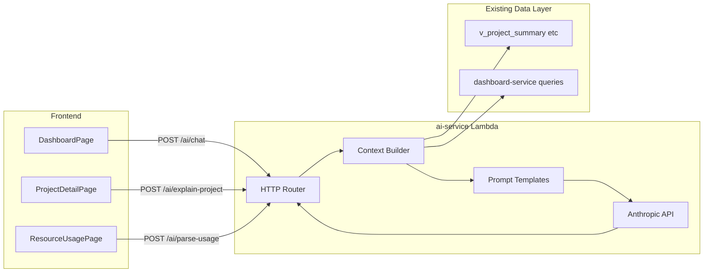

# Gen AI MVP Product Definition & Implementation Plan

## Product thesis

The app already answers **"Is a project burning faster than it's finishing?"** with deterministic RAG scoring ([`database/schema/004_functions_triggers.sql`](database/schema/004_functions_triggers.sql)). Gen AI should not replace that math—it should **translate signals into action**: explain *why* a project is at risk, answer portfolio questions in natural language, and reduce manual data entry.

**Design principle:** LLM as narrator + advisor on top of structured data, never as source of truth for metrics.



---

## MVP feature catalog (prioritized)

### Feature 1: RAG Health Explainer (P0)

**User story:** As a project manager viewing a red/amber project, I want a plain-language explanation of health drivers and recommended next steps so I can act without interpreting burn charts.

**Where it lives:** [`frontend/src/pages/ProjectDetailPage.jsx`](frontend/src/pages/ProjectDetailPage.jsx) — new `ProjectInsightCard` below `HealthGauge`.

**Input context (server-built, not user-provided):**
- Project summary from `v_project_summary`
- Last 10 usage entries for the project
- Team allocations + overallocation flags
- Upstream/downstream dependencies with their RAG status

**Output (structured JSON from LLM):**
```json
{
  "headline": "Budget burn is outpacing delivery progress",
  "why": ["Budget 78% consumed vs 52% complete", "Hours burn 71% vs completion"],
  "risks": ["Likely budget overrun before end date"],
  "actions": [
    { "priority": "high", "text": "Review scope with PM; update completion % if work finished" },
    { "priority": "medium", "text": "Reconcile last 2 weeks of usage entries" }
  ],
  "confidence": "high"
}
```

**Model:** Claude Sonnet (fast, on-demand per page load / refresh button).

**Acceptance criteria:**
- Explanation references only numbers present in context payload
- Works for green projects (positive reinforcement, not just warnings)
- Graceful fallback when `ANTHROPIC_API_KEY` is missing ("AI insights unavailable")

---

### Feature 2: Portfolio Copilot (P0)

**User story:** As a portfolio leader on the dashboard, I want to ask questions like *"Which active projects are red and over 80% budget?"* or *"Who is overallocated this week?"* without clicking through filters.

**Where it lives:** [`frontend/src/pages/DashboardPage.jsx`](frontend/src/pages/DashboardPage.jsx) — collapsible `AiCopilotPanel` (chat drawer or side panel).

**Supported question types (MVP scope):**
| Intent | Data source |
|--------|-------------|
| RAG / at-risk projects | `get_projects_at_risk()`, `v_project_summary` |
| Portfolio KPIs | `v_portfolio_dashboard` |
| Overallocation | `v_employee_allocation_summary` |
| Single project lookup | `v_project_summary` filtered by name |

**Flow:**
1. User sends message + optional conversation history (last 4 turns, client-held)
2. `ai-service` runs lightweight **intent classifier** (Sonnet, single call with JSON schema) → selects context fetchers
3. Fetches structured JSON from Postgres (reuse queries from [`backend/dashboard-service/postgres_service.py`](backend/dashboard-service/postgres_service.py))
4. Second Sonnet call generates answer with inline metric citations

**Example prompts handled in MVP:**
- "Summarize portfolio health"
- "List red projects"
- "Who is overallocated?"
- "Tell me about Project Phoenix" (fuzzy name match)

**Out of scope for MVP:** free-form SQL generation, write actions ("reallocate Sarah to Project X"), cross-session memory in DB.

**Model:** Claude Sonnet for both classification and response.

---

### Feature 3: Smart Usage Entry (P1)

**User story:** As a team member logging hours, I want to type *"6h on API work for Phoenix yesterday"* and have the form pre-filled for my confirmation.

**Where it lives:** [`frontend/src/pages/ResourceUsagePage.jsx`](frontend/src/pages/ResourceUsagePage.jsx) — optional "Quick log with AI" text field above the form.

**Flow:**
1. `POST /ai/parse-usage` with `{ "text": "...", "user_id": "..." }`
2. Server attaches project list + employee list (for name resolution)
3. Sonnet returns structured parse:
```json
{
  "project_id": "uuid-or-null",
  "project_name_guess": "Phoenix",
  "employee_id": "uuid-or-null",
  "hours_used": 6,
  "usage_date": "2026-06-09",
  "notes": "API work",
  "ambiguities": ["Multiple projects match 'Phoenix'"]
}
```
4. Frontend opens create dialog pre-filled; user must confirm before `usage.create()`

**Guardrails:**
- Never auto-save without explicit user confirmation
- Reject parse if confidence is low or required fields missing
- Default `employee_id` to logged-in user's linked employee when available

**Model:** Claude Sonnet.

---

## Technical architecture

### New service: `backend/ai-service/`

Copy scaffold from [`backend/rag-service/`](backend/rag-service/) (same Lambda patterns: `function.py`, `http_router`, `auth_jwt`, `pg_connection`, `responses`).

**New modules:**
| File | Responsibility |
|------|----------------|
| `anthropic_client.py` | HTTP calls to Anthropic Messages API; model routing (`claude-sonnet-4-20250514` default, `claude-opus-4-20250514` reserved for Phase 2) |
| `context_builder.py` | Postgres queries assembling grounded context objects |
| `prompts/` | System prompts with strict "use only provided data" instructions |
| `schemas.py` | JSON response schemas for explain / chat / parse |

**API endpoints:**

| Method | Path | Feature |
|--------|------|---------|
| `POST` | `/explain-project` | `{ "project_id": "uuid" }` → insight JSON |
| `POST` | `/chat` | `{ "message": "...", "history": [...] }` → `{ "answer": "...", "sources": [...] }` |
| `POST` | `/parse-usage` | `{ "text": "..." }` → parsed usage draft |

All routes JWT-protected (same as existing services).

### Environment variables

Add to [`infra/locals.tf`](infra/locals.tf) `env_vars` (ai-service only via Terraform override or shared block):

| Variable | Purpose |
|----------|---------|
| `ANTHROPIC_API_KEY` | API key (Secrets Manager in cloud, `.env.local` for dev) |
| `AI_MODEL_FAST` | Default `claude-sonnet-4-20250514` |
| `AI_MODEL_DEEP` | Default `claude-opus-4-20250514` (Phase 2) |

Add `urllib3` or use stdlib `urllib.request` for Anthropic HTTP (avoid heavy deps in Lambda). No new pip packages required if using stdlib.

### Dev proxy & frontend wiring

- Register `ai: 'ai-service'` in [`bin/proxy-server.js`](bin/proxy-server.js) `ROUTE_TO_ENDPOINT`
- Add `ai` module to [`frontend/src/services/api.js`](frontend/src/services/api.js)
- Add mock handlers in [`frontend/src/services/mockBackend.js`](frontend/src/services/mockBackend.js) so demo mode works without API key

### New frontend components

| Component | File |
|-----------|------|
| `ProjectInsightCard` | `frontend/src/components/ProjectInsightCard.jsx` |
| `AiCopilotPanel` | `frontend/src/components/AiCopilotPanel.jsx` |
| `SmartUsageInput` | `frontend/src/components/SmartUsageInput.jsx` |

Use existing MUI patterns from [`frontend/src/components/ui.jsx`](frontend/src/components/ui.jsx) for loading/error states.

---

## Prompt & safety guardrails

Every system prompt must include:
1. **Grounding rule:** "Only cite numbers from the `context` JSON. If data is missing, say so."
2. **No hallucinated IDs:** Return names; server resolves UUIDs
3. **Tone:** Professional, concise, action-oriented (internal enterprise tool)
4. **Length limits:** Explain ≤ 200 words; chat ≤ 300 words; parse = JSON only

Log prompt token estimates server-side; cap context size (top 20 projects max in portfolio chat).

---

## Success metrics (MVP)

| Metric | Target |
|--------|--------|
| Explain latency (p95) | < 4s with Sonnet |
| Chat answer accuracy (manual spot-check) | 90%+ metrics match DB |
| Usage parse confirmation rate | > 70% of parses accepted without edit |
| Workshop demo | Full flow works with mock backend AND live Anthropic key |

---

## Implementation sequence

Build in this order to de-risk integration early:

1. **Scaffold `ai-service`** — copy rag-service, add Anthropic client with health-check endpoint `GET /health`
2. **Context builder + explain-project** — smallest vertical slice; validate grounding
3. **ProjectInsightCard UI** — wire to real + mock API
4. **Portfolio chat** — intent routing + dashboard context
5. **AiCopilotPanel UI** — dashboard integration
6. **parse-usage endpoint + SmartUsageInput** — confirm-before-save flow
7. **Infra/proxy/env** — wire `ANTHROPIC_API_KEY`, regenerate `.env.local`

---

## Key files to leverage (not reinvent)

- RAG math stays in DB triggers — AI reads results via [`backend/rag-service/postgres_service.py`](backend/rag-service/postgres_service.py)
- Portfolio queries: [`backend/dashboard-service/postgres_service.py`](backend/dashboard-service/postgres_service.py)
- Reporting views: [`database/schema/005_views.sql`](database/schema/005_views.sql)
- Frontend API pattern: [`frontend/src/services/api.js`](frontend/src/services/api.js)

---

## Risks & mitigations

| Risk | Mitigation |
|------|------------|
| LLM invents metrics | Structured context + JSON output schema + UI shows source chips |
| API cost/latency | Sonnet default; cache explain results 5 min per project (in-memory Lambda cache or optional Postgres `ai_insights_cache` table) |
| No API key in workshop | Mock backend returns canned insights; live mode shows clear setup message |
| Lambda outbound HTTP blocked | Verify VPC/NAT or run ai-service outside VPC (same as other services today) |
